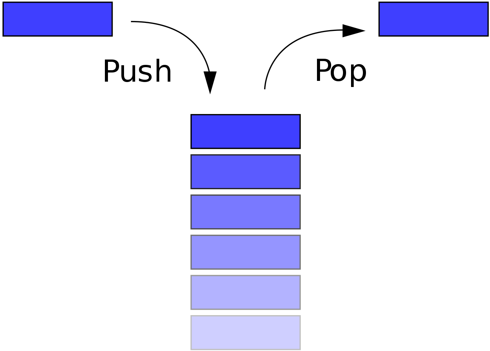
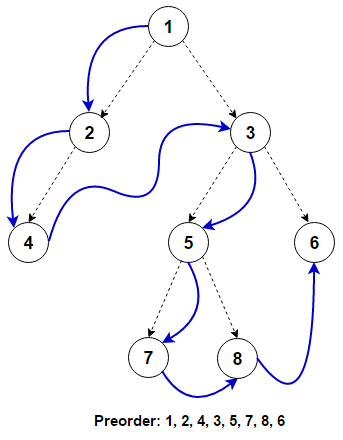
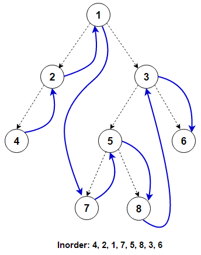
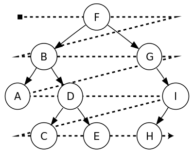

# 线性表（Linear List）

## 名词解释

严蔚敏的书中定义线性表是有限序列，具有头尾，除了头尾元素之外每个元素有且仅有一个前驱、一个后继。线性表可以用顺序实现和链式实现

邓俊辉的书中，没有定义线性表，而是用向量（相当于线性表顺序实现）和列表（相当于线性表链式实现）。此后的名词，如果不加解释，使用邓书中的名称

## 向量（Vector）

逻辑上相邻的元素物理位置也相邻。相当于一个封装起来的C数组

### 空间管理

* 静态空间管理

内部数组的大小不允许调整。因此需要留有合适的预留空间，使装填因子（load factor），即实际规模（有内容的单元数）与占据空间的比值不大于1，且不太小。

* 动态空间管理（可扩充向量）

可用空间耗尽后，就申请一段容量更大的内存，把原来的内容复制过去。每次扩容的时间代价为O(N)，假设在即将耗尽时扩容，每次都扩大一倍。则平均进行N次插入需要一次扩容，分摊时间为O(N) / N = O(1)。每次按比例扩容的分摊时间复杂度为常数（但是常数扩容在N很大时就会拥有O(N)的分摊时间），在大多数场合都是高效率的，但对单次操作耗时敏感的场合仍会遇到问题

当装填因子远小于1时，为了节省空间可以缩容。和扩容相同，按比例缩容的策略有常数时间复杂度。需要考虑扩容缩容阈值，以避免频繁交替扩容缩容

## 列表（List）

也称作链表（Linked List）。逻辑上相邻的元素，其物理位置不必相邻，而是通过索引相连接。它进行插入、删除操作时不需要移动大量元素，更容易动态管理内存，但是访问必须循链接访问

### 实现

```c++
// 列表节点结构体
template <typename T>
struct ListNode
{
    T data;
    ListNode* next;
};

template <typename T>
class List
{
  public:
    List() {header.next = 0;}
    ~List();
    T& operator[](int index) const;
    void insert(int index, const T& data);
    void remove(int index);
  private:
    ListNode<T> header;
};

template <typename T>
List<T>::~List()
{
    // 析构函数，释放所有分配的节点内存
    ListNode<T>* node = header.next;
    while (node) {
        ListNode<T>* temp = node->next;
        delete node;
        node = temp;
    }
}

template <typename T>
T& List<T>::operator[](int index) const
{
    // 重载[]运算符，可以像数组一样访问。没有考虑超出范围时的处理
    ListNode<T>* node = header.next;
    for (int i = 0; i < index; i++) node = node->next;
    return node->data;
}

template <typename T>
void List<T>::insert(int index, const T& data)
{
    ListNode<T>* new_node = new ListNode<T>;
    new_node->data = data;

    ListNode<T>* pred = &header;
    for (int i = 0; i < index; i++) pred = pred->next;
    ListNode<T>* temp = pred->next;
    pred->next = new_node;
    new_node->next = temp;
}

template <typename T>
void List<T>::remove(int index)
{
    index = to_legal_idx(index);
    ListNode<T>* pred = &header;
    for (int i = 0; i < index; i++) pred = pred->next;
    ListNode<T>* temp = pred->next;
    pred->next = temp->next;
    delete temp;
    _size -= 1;
}
```

## 排序算法

* 插入排序

  1. 假设 [0, r) 已经排序，[r, N) 未排序
  2. 在已经排序的区域中查找使`Seq[i - 1] < Seq[r] < Seq[i]`的 i（顺序查找，二分，etc.）
  3. 将 Seq[r] 移动到 i 位置
  4. 重复，直到整个表都已经排序

  N步迭代，涉及查找、移动两种操作。对于向量，二分查找平均O(logN)、移动平均O(N)，总共O(N*(N + logN)) = <span style="background-color:#FFFF00">O(N^2)</span>；对于列表，只能用顺序查找O(N)，删除和插入O(1)（查找时已经定位了移动的源和目标，只需修改一下指针的值），总共O(N * (N + 1)) = <span style="background-color:#FFFF00">O(N^2)</span>

  相比之下不难发现，向量在做静态查找时效率更高，而需要动态修改的场合列表的效率更高

* 选择排序

  1. 假设 [0, r) 已经排序，[r, N)未排序
  2. 在未排序区查找最小元素 Seq[i]
  3. 交换 Seq[r] 和 Seq[i]
  4. 重复，直到整个表都已经排序

  类似插入排序的分析，可得选择排序复杂度是O(N^2)。不止如此，如果使用最简单的查找方式，在无序区扫一次查找，查找的复杂度是Θ(N)，交换Θ(1)，所以复杂度是Θ(N^2)，效率固定。相对比，插入排序在完全顺序的情况下最好，O(N)，完全逆序时最差，O(N^2)

* 归并排序

  ```c++
  template <typename T>
  void merge_sort(List<T> list, int left, int right)
  {
      // 对[left, right)范围的元素做并归排序
      if (right == left) {
          return;
      } else {
          // 分别对前半段和后半段做归并排序
          int mid = (right - left) / 2;
          merge_sort(list, left, mid);
          merge_sort(list, mid, right);
          // 将前后两端归并（合并两个有序列表，并且保持有序性）
          merge(list, left, mid, list, mid, right);
      }
  }
  ```
  使用归并排序时，随着每次递归，排序被拆分为两个子列表的排序，直到被拆分为0个或1个元素。然后，将这些子序列再合并起来，就得到完整的有序序列。
  
  对于向量，不难看出二路归并的时间为Θ(M + N)。使用递推法分析时间复杂度，对长度为N的序列进行归并排序相当于排序两个长度N/2的序列，再将他们归并，故$T(N) = 2 \times T(\frac{N}{2}) + O(N)$；再考虑边界条件，长度为1时直接返回，故$T(1) = O(1)$
  $$
  \left\{
  \begin{aligned}
      T(N) & = 2 \times T(\frac{N}{2}) + \Theta(N) \\
      T(1) & = \Theta(1)
  \end{aligned}
  \right.\\[6ex]
  
  let \ S(N) = \frac{T(N)}{N} \\
  \begin{alignat}{0}
  \therefore S(N) &= 2 \times S(\frac{N}{2}) + \Theta(1) \\
  &= k \times S(\frac{N}{2^k}) + \Theta(k) \\[1ex]
  &= logN \times S(1) + \Theta(logN) \\[1ex]
  &= \Theta(logN) \\[2ex]
  \therefore T(N) &= \Theta(NlogN)
  \end{alignat}
  $$
  对于列表，归并的复杂度仍相同，但划分时为了确定中点需要O(N)的时间，总体的时间复杂度仍然是O(NlogN)。假设不按照中点划分，而是定长区段，用递推法可分析得复杂度为O(N^2)。特别地，当某一段的长度为1，退化为插入排序

# 栈

栈（Stack）的操作只能从一端进行入栈（Push）和出栈（Pop）操作，这一端称作栈顶，另一端称作栈底。其特征是后进先出（last in first out，LIFO）



## 括号匹配

遇到左括号就压入栈，遇到右括号就弹出栈顶左括号与其比对，属于同类就继续检查，否则判定括号不匹配。如果遇到右括号时栈空，或者扫描结束后栈未空，也说明不匹配

## 表达式求值

先定义运算符优先级，并用操作数栈、运算符栈缓冲操作数和运算符，运算后将结果压回操作数栈。从左向右扫描表达式，

1. 遇到操作数（operand）：放进操作数栈
2. 遇到运算符（operator）：比较当前运算符和栈顶运算符的优先级
   1. 当前运算符优先级高：栈顶运算不能进行
   2. 栈顶运算符优先级高：立即弹出并进行运算
   3. 相等：均可，不影响结果

```c++
int priority(char a, char b)
{
    // 比较运算符优先级
    // 如果a优先级高返回1；优先级相等返回0；a优先级低返回-1
    char opnds[] = {'(', '*', '/', '+', '-', ')', '\0'}
    for (int i = 0; i < 8; i++) {
        if (opnds[i] == a && opnds[i] != b) return 1;
        else if (opnds[i] == a && opnds[i] == b) return 0;
        else if (opnds[i] == b) return -1;
    }
}

// 为了简便起见，只考虑操作数只有1位数，算式合法
int evaluate(const char exp[])
{
    Stack<double> opnd;
    Stack<char> optr;
    optr.push('\0');
    char* head = exp;
    
    while (!optr.empty()) {
        if ('0' <= *head and '9' >= *head) {
            opnd.push((double)(*head - 9));
            head++;
        } else {
            switch (priority(*head, optr.top())) {
                case 1: optr.push(*head); head++; break;
                case 0:
                case -1: // 栈顶运算符优先级更高或相同
                    char op = optr.pop()
                    switch(op) {
                        case '+': opnd.push(opnd.pop() + opnd.pop()); break;
                        case '-': opnd.push(opnd.pop() - opnd.pop()); break;
                        case '*': opnd.push(opnd.pop() * opnd.pop()); break;
                        case '/': opnd.push(opnd.pop() / opnd.pop()); break;
                        case '(':
                            if (*head != ')') {
                                opnd.push(op);
                                opnd.push(*head);
                            }
                            head++;
                            break;
                        case '\0': optr.pop(); break;
                    }
            }
        }
    }
    return opnd.pop();
}
```

## 逆波兰表达式

## 回溯法求解八皇后问题

如何在国际象棋棋盘上放8个皇后，使每一个皇后无法一步吃掉其他皇后？已知国际象棋棋盘大小为8x8，皇后移动范围是横、竖、对角线

1. 第一行第一列放（入栈）一个棋子
2. **试探**：在第二行第一列放一个试探棋子，检查它能否被已经放置的棋子一步吃掉。如果能，就将试探棋子移动到下一列，继续试探；如果不能，将其入栈，试探下一行
3. **回溯**：重复试探到某一行每个位置都不允许放时，栈顶棋子出栈，恢复到了还在试探上一个棋子的状态，然后继续试探

所有可能的试探过程（也称作搜索空间）可以构成一棵树。对于八皇后问题，比如说，假设某次试探第四行每个位置都不允许放了，那就说明前三个的放置是不允许的，剩余的五六七八行都没有试探必要了，排除了搜索树的一整颗子树。这一技巧也称作<span style="background-color:#FFFF00">剪枝（pruning）</span>

N皇后问题一共有$N^N$种棋局。简单的实验显示，剪枝后试探次数 / 全棋局数 = $O(e^N)$，N = 8时大约只有0.1%的棋局被测试。但复杂度仍然为$O(N^N)$，我的实验也只能做到N = 14，再多就非常花时间了

```c++
#include <list>
#include <algorithm>

class Queen
{
  public:
    int x, y;
    Queen(int x_, int y_): x(x_), y(y_) {}
    bool operator==(const Queen& q) {
        // 重载判等操作符，判断两个皇后之间是否冲突
        return (x == q.x) || (y == q.y) || (x+y == q.x+q.y) || (x-y == q.x-q.y);
    }
};

// 利用std::list作为栈记录结果
//之所以不用std::stack是因为stack不能访问栈顶以外的元素，无法判断是否和其他棋子冲突
typedef std::list<Queen> solution;

std::list<solution> queens(const int n)
{
    solution solu;  // 试探回溯的栈
    std::list<solution> solutions;
    Queen q(0, 0);

    while (true) {
        if (q.y >= n) {
            // 出界，说明这个分支无解。剪枝
            q = solu.back();
            q.y++;
            solu.pop_back();
        } else if (std::find(solu.begin(), solu.end(), q) != solu.end()) {
            // 冲突，尝试下一个位置
            q.y++;
        } else {
            // 合法，放置棋子，并试探下一个棋子
            solu.push_back(q);
            q.x++;
            q.y = 0;
        }

        if (solu.size() == n) {
            // 放满n个棋子，得到一个解。记录这个解，并继续试探
            solutions.push_back(solu);
            q = solu.back();
            q.y++;
            solu.pop_back();
        } else if (q.x == 0 && q.y == n) {
            // 全部情况尝试完
            break;
        }
    }
    return solutions;
}
```


## Hanoi塔


# 队列

队列（Queue）只能从队头（front）入队（enqueue）、队尾（rear）出队（dequeue），符合先进先出（first in first out，FIFO）的规律


## 排队事件模拟


# 二叉树

二叉树（Binary Tree）是每个节点度数不超过2的树。一般都是有序二叉树（两个子树可以相互区分，称作左子树和右子树）

## 遍历

遍历（Traversal）指按照某种次序访问每个节点各一次。遍历将半线性的结构转换成线性结构

为了定义整棵树的次序，先定义一个节点处的局部次序：记节点和左右孩子分别为V，L，R，局部次序一般取VLR（先序遍历）、LVR（中序遍历）、LRV（后序遍历）。（记忆：总是先L后R，V在前/中/后就是相应的序）

```
  v
┌─┴─┐
L   R
```

* **先序遍历**（Preorder Traversal）



```c++
void pre_trav(BinTree tree)
{
    // 迭代实现先序遍历
    if (!tree) return;
    visit(tree->data);
    pre_trav(tree->left_child);
    pre_trav(tree->right_child);
}
```

* **中序遍历**（Inorder Traversal）



* **后序遍历**（Postorder Traversal）


* **层次遍历**（Level Order Traversal）



```c++
void level_trav(BinTree tree)
{
    queue<BinNode*> q;     // 辅助队列
    q.enqueue(tree.root);
    while (!q.empty()) {
        BinNode* node = q.dequeue();
        visit(node);
        if (node.left_child) q.enqueue(node.left_child);
        if (node.right_child) q.enqueue(node.right_child);
    }
}
```

## 完全二叉树

除了最底层全部填满，最底层从左到右填满的二叉树称作完全二叉树（Complete Binary Tree）。特别地，如果全部填满的称作满二叉树，有时也称作完美二叉树（Perfect Binary Tree）

高度为 h 的完全二叉树，节点数$n \in [2^h, \; 2^{h+1} - 1]$。当$n = 2^{h+1} - 1$时为满二叉树

按照层次遍历的顺序将完全二叉树储存在向量中，容易证明，`t[i]`对应节点的左子节点位于`t[2*i + 1]`，右子节点位于`t[2*i + 2]`，因此完全二叉树可以实现紧凑存储和高效访问

## PFC编码树

前缀无歧义编码（prefix-free code）是一种解码时不产生歧义的编码，它要求任意两字符的二进制编码互相不是对方的前缀

假设对字符串"MESSAGE"进行编码，方式为

| A    | E    | G    | M    | S    |
| ---- | ---- | ---- | ---- | ---- |
| 00   | 01   | 10   | 110  | 111  |

用一棵二叉树表示这个编码，

```
    root
  ┌───┴───┐
  0       1
┌─┴─┐   ┌─┴─┐
A   E   G  ┌┴┐
           M S
```

从左到右地扫二进制串，遇到0就移动到左节点，遇到1就移动到右节点，遇到叶就输出一个字符，并且回到根节点。如此，就能够得到解码后的结果。显然，只要所有字符都处于叶节点，编码就是无歧义的

# 图

G = (V, E)，图（Graph）由<span style="background-color:#FFFF00">顶点（Vertex，Node）</span>和<span style="background-color:#FFFF00">边（Edge，Arc）</span>组成。评价复杂度时，一般包含顶点数 |V| 和边数 |E| 两部分，并且，不难看出，$|E| = O(|V|^2)$。根据边是否有向，可以分为有向图（Directed Graph，digraph）、无向图（Undirected Graph，undigraph）和混合图（Mixed Graph）

## 图的实现

* **邻接矩阵**（Adjacency Matrix）

邻接矩阵（Adjacent Matrix）是图的最基本实现方式。使用`Vector<Vertex>`记录所有顶点，并用`Vector<Vector<Edge*>>`（$|V| \times |V|$方阵）记录边，`A[u][v]`表示 u 到 v 顶点的一条边

```c++
template <typename Tv, typename Te>
class Graph
{
    vector<Tv> vortexes;
    vector<vector<Te>> edges;
}
```

类似于向量，这种方法的静态接口时间复杂度都是O(1)，动态接口分摊复杂度O(|V|)（详见向量动态空间管理一节）；另外，空间复杂度$\Theta ( |V|^2)$。特别地，对于无向图，(u, v) 和 (v, u) 等价，可以只记录上三角部分

* **邻接列表**（Adjacency List）

将记录边的方阵从向量换成列表`List<List<Edge*>>`。应用中大多数图e = O(n)，因此使用列表能大大节约空间。邻接表访问单条边的效率不如邻接矩阵，但是以批量方式处理同一个顶点的关联边时比邻接矩阵还要高

## 遍历算法

* **广度优先搜索**（Breadth first search，BFS）

<span style="background-color:#FFFF00">越靠近起始点的越先被访问</span>。作用于树，就是层次遍历

1. 将所有节点标记为未访问
2. 定义一个FIFO队列（前沿集）存储将要访问的节点，选定一个起始节点，加入前沿集
3. 从前沿集取出一个节点，访问它，将它标记为已访问，然后将它所有未访问邻居加入前沿集
4. 重复第三步直到前沿集空。对于无向图，此时所有连通分量（Connected Component）都被访问；对于有向图，所有可达分量（Reachable Component）都必定被访问过了。如果还有没访问的，重新选取起始节点，重复第二步

如果遍历的同时记录每个节点是被谁加入到前沿集中的，就给每个点定下了唯一的父节点，构成了一棵<span style="background-color:#FFFF00">广度优先搜索树</span>（BFS Tree）。下图是BFS树实例，从S点起始，S为根节点，实线是树的边（同时也是图的边），虚线是图的边但不是树的边，也称作跨边（Cross Edge）。假如一次遍历没有抵达所有顶点，多次遍历产生的BFS树构成BFS森林


BFS需要记录每个顶点状态，前沿集辅助队列，故空间复杂度O(|V|)。如果还要记录BFS树，则为O(|V|+|E|)。需要初始化节点状态，每个节点访问一次，每条边都要访问（寻找邻居），故时间复杂度O(|V|+|E|)

* **深度优先搜索**（Depth First Search，DFS）

尽可能深地搜索，直到节点V相连节点全都被遍历过之后，回溯到发现V的节点

* **拓扑排序**（Topological Sorting）

将有向图顶点排成线性序列，同时任何顶点都没有指向序列前驱顶点的边。对于含有环路的有向图，拓扑排序不存在；对于有向无环图，拓扑排序存在不唯一。

简易证明：有环图不存在拓扑排序显然；无环图存在入度为0的顶点，任意选一个入度为0的顶点做序列首元素，从图中排除这个节点，剩下的还是无环图，重复上一步直到所有节点加入序列，得到一个拓扑排序。考察下列的图

```
A -> B
↓    ↓
C -> D
```

显然ABCD和ACBD都是拓扑排序，因此不唯一